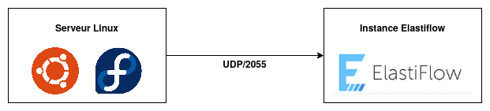

# Elastiflow

> ElastiFlow™ provides network flow data collection and visualization using the Elastic Stack (Elasticsearch, Logstash and Kibana). It supports Netflow v5/v9, sFlow and IPFIX flow types (1.x versions support only Netflow v5/v9).

Sur la page du projet [Github](https://github.com/robcowart/elastiflow) on peut lire "now deprecated ([try the new solution](https://github.com/robcowart/elastiflow))", nouvelle solution payante. Le projet Github est encore fonctionnel et fait largement l'affaire pour un lab étudiant.

Table of Contents
=================

* [Architecture](#architecture)
* [Installation](#installation)
  * [Elastiflow](#elastiflow-1)
  * [Serveur Linux](#serveur-linux)
  * [Nginx reverse proxy](#reverse-proxy)
  * [Debug](#debug)

## Architecture

> Proposition d'architure "simple", à vous de l'adapter en fonction de vos besoins.



Dans cet exemple le serveur Linux va exporter les informations de ses flux réseaux vers l'instance Elastiflow. Cet export est réalisé via [softflowd](https://github.com/irino/softflowd).

## Installation

### Elastiflow

Testé et validé sur une machine Ubuntu 20.04 avec les versions suivantes :

| Outil | Version |
| ----- | ----- |
| Elasticsearch | 7.13 |
| Kibana | 7.13 |
| Logstash | 7.13 |
| Elastiflow | 4.0.1 |

La procédure d'installation sur le Github du projet est claire et détaillée mais pour simplifier les choses et automatiser les installations nous avons un script qui va faire une grande partie du travail à notre place :

```
curl https://raw.githubusercontent.com/simplonco/tssr-cyber-doc/main/docs/elastiflow/elastiflow.sh | bash -
```

Le script `elastiflow.sh` va :

* Installer Ansible
* Télécharger un playbook qui va réaliser toute l'installation

Une fois terminé il faut patienter un peu le temps que les services démarrent mais après quelques minutes vous devriez avoir le port :2055 de votre serveur en écoute

```
lsof -i :2055
COMMAND   PID     USER   FD   TYPE DEVICE SIZE/OFF NODE NAME
java    28670 logstash  151u  IPv4  81489      0t0  UDP *:2055
```

Quand l'étape suivante (installation softflowd) sera terminée vous devriez voir un index Elasticsearch `elastiflow-*` :

```
curl -s 'localhost:9200/_cat/indices/elastiflow-*?v=true&s=index'
health status index                       uuid                   pri rep docs.count docs.deleted store.size pri.store.size
yellow open   elastiflow-4.0.1-2021.06.14 Q3z_o9DCRyyARw56vqPmZA   3   1        383            0        1mb            1mb
```

C'est bon, vous recevez des données !

Il ne vous reste plus qu'à [configurer Kibana et importer les visualisations et dashboards](https://github.com/robcowart/elastiflow/blob/master/INSTALL.md#setting-up-kibana)

Par défaut Kibana écoute uniquement en local sur le port 5601, pour le faire écouter sur une autre adresse et éventuellement le mettre derrière un reverse proxy Nginx il faudra modifier le fichier de configuration `/etc/kibana/kibana.yml` avec quelque chose comme :

```
server.port: 5601
server.host: "192.168.100.101"
```

### Serveur Linux

Il existe sûrement d'autres solutions mais dans notre cas nous utilisons `softflowd` pour l'export vers Elastiflow. Installer softflowd : `apt-get install softflowd`

En phase de test / expérimentation vous pouvez utiliser une commande comme :

```/usr/sbin/softflowd -i vmbr0 -P udp -d -D -n 192.168.200.101:2055```

Explications :

* `-i` : spécifier l'interface sur laquelle on va écouter (`any` pour toutes les interfaces), seulement vmbr0 dans notre exemple
* `-P` : tcp ou udp
* `-d` : ne pas faire tourner en arrière plan
* `-D` : mode debug
* `-n` : où réaliser l'export (`host:port`), 192.168.200.101 sur le port 2055 dans notre exemple

Vous devriez voir quelque chose comme :

```
/usr/sbin/softflowd -i any -P udp -d -D -n 192.168.200.101:2055
softflowd v0.9.9 starting data collection
Exporting flows to [192.168.200.101]:2055
ADD FLOW seq:1 [5.39.74.133]:22 <> [51.210.251.129]:50530 proto:6
ADD FLOW seq:2 [5.39.74.133]:22 <> [111.198.48.204]:45714 proto:6
ADD FLOW seq:3 [5.39.74.133]:22 <> [125.124.215.222]:55386 proto:6
ADD FLOW seq:4 [fe80::6eb2:aeff:fe60:82c7]:2029 <> [ff02::66]:2029 proto:17
[ .... ]
Starting expiry scan: mode 0
Queuing flow seq:22 (0x55dba9053ff0) for expiry reason 2
Queuing flow seq:24 (0x55dba9053eb0) for expiry reason 2
Queuing flow seq:25 (0x55dba9053e10) for expiry reason 2
Queuing flow seq:29 (0x55dba9053b90) for expiry reason 2
Queuing flow seq:31 (0x55dba9053a50) for expiry reason 2
Queuing flow seq:34 (0x55dba9055990) for expiry reason 2
Finished scan 6 flow(s) to be evicted
Sending v5 flow packet len = 600
sent 1 netflow packets
```

Après validation des options à utiliser il n'y a plus qu'à les reporter dans le fichier de configuration `/etc/softflowd/default.conf`

```
interface='any'
options='-P udp -n host:port'
```

Et démarrer le service

```
systemctl enable --now softflowd
systemctl start softflowd
systemctl status softflowd
```

### Reverse proxy

Accéder à votre instance Kibana via Nginx.

Installer le nécessaire

```
apt-get install --assume-yes nginx python3-certbot-nginx
```

Générer un certificat

```
certbot certonly --nginx -d domain.tld -m 'admin_email' --agree-tos -n
```

Configuration Nginx

```
# copier le fichier nginx/nginx.conf dans /etc/nginx/sites-enabled/domain.tld.conf et l'adapter (lignes 3 et 10)
# copier le fichier nginx/ssl.conf dans /etc/nginx/ssl.conf et l'adapter (lignes 3 à 5)
nginx -t		# pour vérifier la configuration
service nginx reload	# redémarrer le service
```

### Debug
